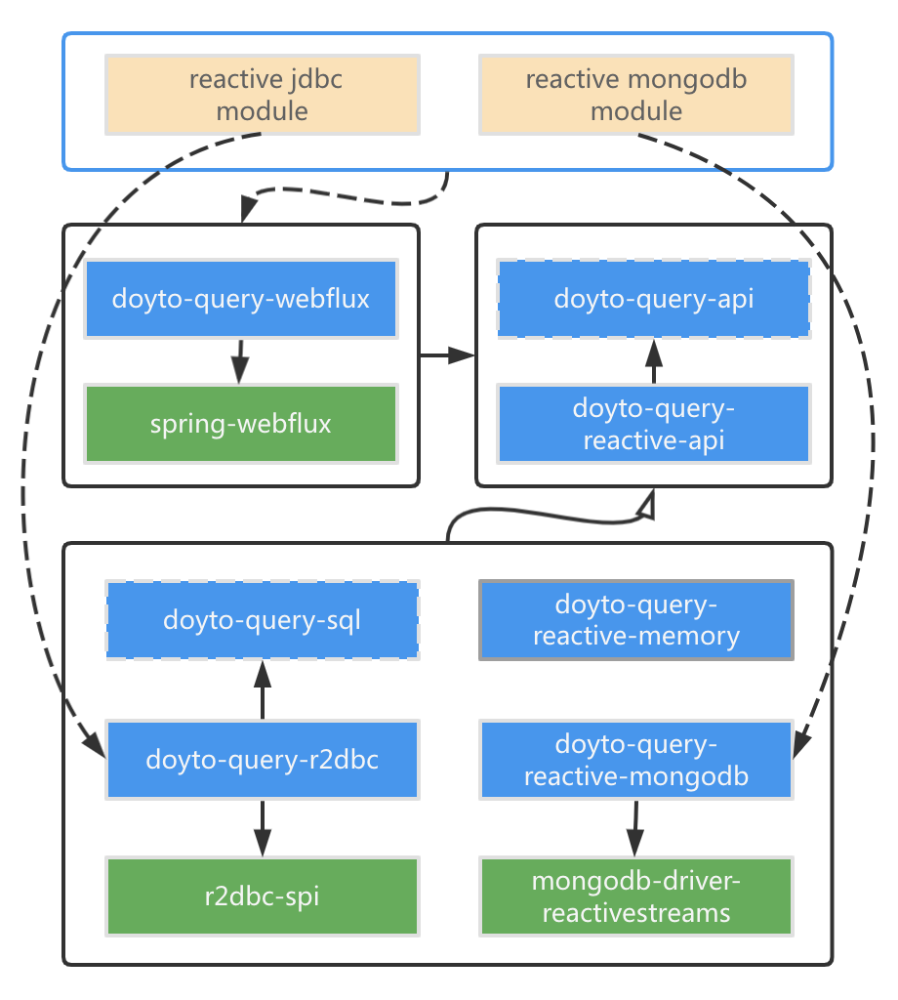

Reactive DoytoQuery
---
The reactive version of [DoytoQuery](https://github.com/doytowin/doyto-query).

Architecture
---

## Versions

| Module                      | Snapshot                                                                                                                           | Release                                                                                                    |
|-----------------------------|------------------------------------------------------------------------------------------------------------------------------------|------------------------------------------------------------------------------------------------------------|
| doyto-query-api             | [![api-snapshots-img]](https://oss.sonatype.org/content/repositories/snapshots/win/doyto/doyto-query-api/)                         | [![api-release-img]](https://search.maven.org/artifact/win.doyto/doyto-query-api/)                         |
| doyto-query-common          | [![common-snapshots-img]](https://oss.sonatype.org/content/repositories/snapshots/win/doyto/doyto-query-common/)                   | [![common-release-img]](https://search.maven.org/artifact/win.doyto/doyto-query-common/)                   |
| doyto-query-reactive-api    | [![reactive-api-snapshots-img]](https://oss.sonatype.org/content/repositories/snapshots/win/doyto/doyto-query-reactive-api/)       | [![reactive-api-release-img]](https://search.maven.org/artifact/win.doyto/doyto-query-reactive-api/)       |
| doyto-query-reactive-memory | [![reactive-memory-snapshots-img]](https://oss.sonatype.org/content/repositories/snapshots/win/doyto/doyto-query-reactive-memory/) | [![reactive-memory-release-img]](https://search.maven.org/artifact/win.doyto/doyto-query-reactive-memory/) |
| doyto-query-sql             | [![sql-snapshots-img]](https://oss.sonatype.org/content/repositories/snapshots/win/doyto/doyto-query-sql/)                         | [![sql-release-img]](https://search.maven.org/artifact/win.doyto/doyto-query-sql/)                         |
| doyto-query-dialect         | [![dialect-snapshots-img]](https://oss.sonatype.org/content/repositories/snapshots/win/doyto/doyto-query-dialect/)                 | [![dialect-release-img]](https://search.maven.org/artifact/win.doyto/doyto-query-dialect/)                 |
| doyto-query-r2dbc           | [![r2dbc-snapshots-img]](https://oss.sonatype.org/content/repositories/snapshots/win/doyto/doyto-query-r2dbc/)                     | [![r2dbc-release-img]](https://search.maven.org/artifact/win.doyto/doyto-query-r2dbc/)                     |
| doyto-query-webflux         | [![webflux-snapshots-img]](https://oss.sonatype.org/content/repositories/snapshots/win/doyto/doyto-query-webflux/)                 | [![webflux-release-img]](https://search.maven.org/artifact/win.doyto/doyto-query-webflux/)                 |

License
-------
This code is under the [Apache Licence v2](https://www.apache.org/licenses/LICENSE-2.0).

[api-snapshots-img]: https://img.shields.io/nexus/s/win.doyto/doyto-query-api?color=blue&server=https%3A%2F%2Foss.sonatype.org
[api-release-img]: https://img.shields.io/maven-central/v/win.doyto/doyto-query-api?color=brightgreen
[common-snapshots-img]: https://img.shields.io/nexus/s/win.doyto/doyto-query-common?color=blue&server=https%3A%2F%2Foss.sonatype.org
[common-release-img]: https://img.shields.io/maven-central/v/win.doyto/doyto-query-common?color=brightgreen
[sql-snapshots-img]: https://img.shields.io/nexus/s/win.doyto/doyto-query-sql?color=blue&server=https%3A%2F%2Foss.sonatype.org
[sql-release-img]: https://img.shields.io/maven-central/v/win.doyto/doyto-query-sql?color=brightgreen
[reactive-api-snapshots-img]: https://img.shields.io/nexus/s/win.doyto/doyto-query-reactive-api?color=blue&server=https%3A%2F%2Foss.sonatype.org
[reactive-api-release-img]: https://img.shields.io/maven-central/v/win.doyto/doyto-query-reactive-api?color=brightgreen
[reactive-memory-snapshots-img]: https://img.shields.io/nexus/s/win.doyto/doyto-query-reactive-memory?color=blue&server=https%3A%2F%2Foss.sonatype.org
[reactive-memory-release-img]: https://img.shields.io/maven-central/v/win.doyto/doyto-query-reactive-memory?color=brightgreen
[r2dbc-snapshots-img]: https://img.shields.io/nexus/s/win.doyto/doyto-query-r2dbc?color=blue&server=https%3A%2F%2Foss.sonatype.org
[r2dbc-release-img]: https://img.shields.io/maven-central/v/win.doyto/doyto-query-r2dbc?color=brightgreen
[reactive-mongodb-snapshots-img]: https://img.shields.io/nexus/s/win.doyto/doyto-query-reactive-mongodb?color=blue&server=https%3A%2F%2Foss.sonatype.org
[reactive-mongodb-release-img]: https://img.shields.io/maven-central/v/win.doyto/doyto-query-reactive-mongodb?color=brightgreen
[webflux-snapshots-img]: https://img.shields.io/nexus/s/win.doyto/doyto-query-webflux?color=blue&server=https%3A%2F%2Foss.sonatype.org
[webflux-release-img]: https://img.shields.io/maven-central/v/win.doyto/doyto-query-webflux?color=brightgreen
[dialect-snapshots-img]: https://img.shields.io/nexus/s/win.doyto/doyto-query-dialect?color=blue&server=https%3A%2F%2Foss.sonatype.org
[dialect-release-img]: https://img.shields.io/maven-central/v/win.doyto/doyto-query-dialect?color=brightgreen
